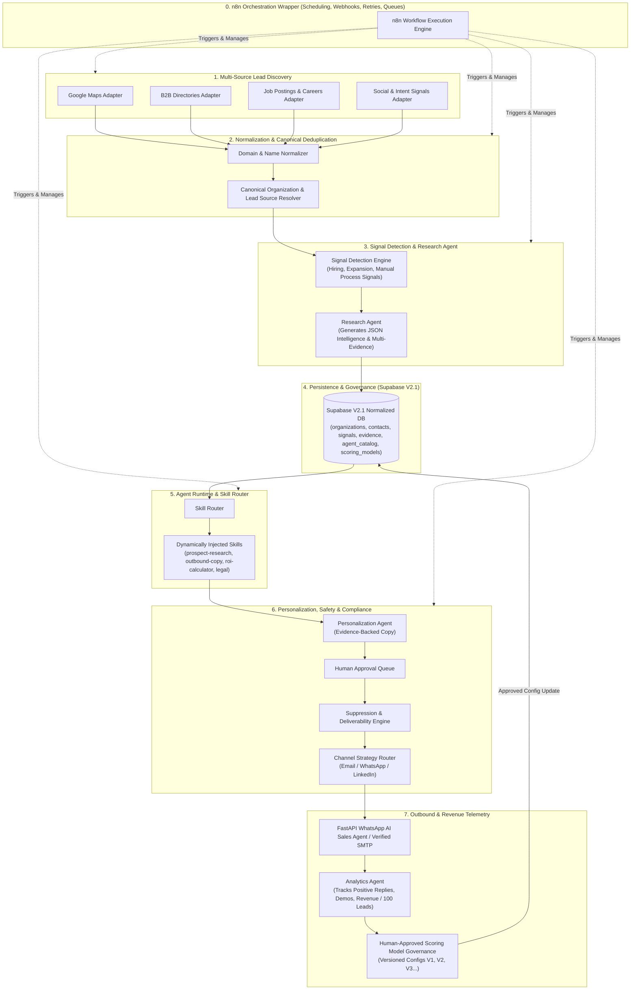

# High-Level Architecture & Design Document (HLD V2.1)
## IBrains Autonomous AI SDR & Revenue Intelligence Platform
**Document Version:** 2.1.0  
**Target Organization:** IBrains AI Engineering Studio  
**Date:** July 25, 2026  
**Status:** V2.1 — ARCHITECTURE APPROVED / READY FOR MVP IMPLEMENTATION  

---

## 1. Executive Summary & Strategic Vision

The **IBrains Autonomous AI SDR & Revenue Intelligence Platform** is a self-improving, enterprise-grade client acquisition system. Rather than acting as an indiscriminate web scraper or spam email engine, the platform identifies high-intent buying signals across public sources, resolves company entities, gathers verified evidence, matches prospects against IBrains' official agent catalog, and executes compliant, human-approved multi-channel outreach.

By wrapping 5 elite open-source frameworks (`gosom/google-maps-scraper`, `apify/agent-skills`, `Jharilela/n8n-workflows`, `sales-skills/sales`, and `w95/awesome-claude-corporate-skills`) inside a robust **n8n Orchestration Layer**, IBrains automates the entire revenue lifecycle from lead discovery to signed client contracts.

---

## 2. Master System Architecture (V2.1 Approved)



---

## 3. Subsystem Detailed Specifications

### Subsystem 0: n8n Orchestration Layer
n8n surrounds and manages all system workflows. Its sole responsibilities are:
- **Cron Scheduling**: Periodic discovery & signal polling.
- **Webhook Handling**: Ingestion of raw lead payloads.
- **Retries & Error Handling**: Exponential backoff on rate-limited APIs.
- **State & Queue Management**: Tracking Human Approval queue states.
- **Agent Invocation**: Invoking Claude Code skills via standardized API payloads.

### Subsystem 1: Multi-Source Discovery Engine
Discovers prospects across distinct acquisition channels:
- **Local Discovery**: Google Maps (`gosom/google-maps-scraper`).
- **B2B Directories**: Crunchbase, Apollo, Clutch (`apify/agent-skills`).
- **Intent Discovery**: Careers pages, job postings (e.g., hiring high-volume recruiters/support staff), Reddit, Product Hunt, social signals.

### Subsystem 2: Normalization & Canonical Deduplication
Prevents duplicate outreach by converting raw inputs to canonical representations:
- **Domain Normalization**: Converts `https://www.abc-tech.com/about` ➔ `abc-tech.com`.
- **Name Normalization**: Resolves `ABC Inc`, `ABC Incorporated`, `ABC Technologies` ➔ `ABC Technologies`.
- **Multi-Source Attribution**: Maintains `lead_sources` table. If a business appears on Google Maps AND has an active job posting, intent confidence score increases automatically.

### Subsystem 3: Signal Engine & Research Agent
The **Research Agent** produces a structured JSON intelligence object backed by an explicit **Evidence Store**:
```json
{
  "organization": { "name": "ABC Staffing", "domain": "abcstaffing.com" },
  "signals": [{ "type": "HIRING_SPIKE", "confidence": 0.94 }],
  "evidence": [
    {
      "source_url": "https://abcstaffing.com/careers/recruiter",
      "evidence_text": "Hiring 8 high-volume recruiters to process 1,000+ candidate applications monthly.",
      "observed_at": "2026-07-25T20:00:00Z"
    }
  ],
  "matched_agent_slug": "resume-shortlisting-agent"
}
```

### Subsystem 4: Relational Agent Catalog (`agent_catalog`)
Rather than using arbitrary string names, opportunities reference the official **`agent_catalog`**:
- HR Voice Agent (`slug: hr-voice-agent`)
- Resume Shortlisting Agent (`slug: resume-shortlisting-agent`)
- Technical Interviewer Agent (`slug: technical-interviewer-agent`)
- Real Estate Voice Agent (`slug: real-estate-voice-agent`)
- Ortho Medical Agent (`slug: ortho-medical-agent`)
- Loan Agent (`slug: loan-agent`)
- Insurance Agent (`slug: insurance-agent`)
- EduFlex EdTech Platform (`slug: eduflex-platform`)

### Subsystem 5: Multi-Factor Lead Scoring & Governance (`scoring_models`)
- **Scoring Weights**:
  - ICP Fit (25 pts) + Pain/Automation Fit (20 pts) + Intent Signal (20 pts) + Decision Maker Access (15 pts) + Value (10 pts) + Evidence Quality (10 pts).
- **Governance**: The Analytics Agent generates **Recommended Scoring Changes** based on conversion data, but **MUST be approved by a human** before updating the active `scoring_models` config (`V1` ➔ `V2`).

### Subsystem 6: Agent Runtime & Skill Router
Injects only the required `SKILL.md` file per workflow step:
- `prospect-research` ➔ Performs company deep dives.
- `outbound-copy` ➔ Writes evidence-backed sales copy.
- `roi-calculator` ➔ Computes hours saved & ROI for AI agents.
- `geo-proposal` ➔ Drafts client proposals.

### Subsystem 7: Human Approval Queue & Guardrails
All outreach messages enter `outreach_messages_v2` with status `PENDING_APPROVAL`. IBrains team members review and approve messages in 1-click to prevent AI hallucinations.

### Subsystem 8: Suppression, Compliance & Deliverability
- Checks `suppression_list` (Opt-outs, Bounces, Do-Not-Contact, Competitors, Existing Clients) before every send.
- Enforces SPF, DKIM, DMARC, bounce handling, and sending limits (Max 30 emails/mailbox/day).

### Subsystem 9: Revenue & Telemetry Feedback Loop
Filters out noisy "email opens" metrics and tracks core revenue telemetry:
$$\text{Revenue Efficiency} = \frac{\text{Total Revenue Generated}}{\text{100 Qualified Leads}}$$

---

## 4. Master Database Migration Schema (`schema_v2_1.sql`)

```sql
-- IBrains Autonomous AI SDR V2.1 Master Database Schema

-- 1. Master Agent Catalog
CREATE TABLE IF NOT EXISTS agent_catalog (
    id UUID PRIMARY KEY DEFAULT gen_random_uuid(),
    name VARCHAR(255) NOT NULL,
    slug VARCHAR(100) UNIQUE NOT NULL,
    description TEXT NOT NULL,
    target_industries TEXT[],
    target_pain_points TEXT[],
    demo_url VARCHAR(255),
    active BOOLEAN DEFAULT TRUE,
    created_at TIMESTAMPTZ DEFAULT NOW()
);

-- 2. Organizations (Normalized & Canonical)
CREATE TABLE IF NOT EXISTS organizations_v2 (
    id UUID PRIMARY KEY DEFAULT gen_random_uuid(),
    name VARCHAR(255) NOT NULL,
    normalized_name VARCHAR(255) NOT NULL,
    domain VARCHAR(255),
    normalized_domain VARCHAR(255) UNIQUE,
    industry VARCHAR(100),
    employee_range VARCHAR(50),
    location VARCHAR(150),
    website VARCHAR(255),
    created_at TIMESTAMPTZ DEFAULT NOW()
);

-- 3. Lead Source Attribution
CREATE TABLE IF NOT EXISTS lead_sources (
    id UUID PRIMARY KEY DEFAULT gen_random_uuid(),
    organization_id UUID REFERENCES organizations_v2(id) ON DELETE CASCADE,
    source_platform VARCHAR(100) NOT NULL,
    source_external_id VARCHAR(255),
    raw_data JSONB,
    created_at TIMESTAMPTZ DEFAULT NOW()
);

-- 4. Decision Maker Contacts
CREATE TABLE IF NOT EXISTS contacts_v2 (
    id UUID PRIMARY KEY DEFAULT gen_random_uuid(),
    organization_id UUID REFERENCES organizations_v2(id) ON DELETE CASCADE,
    name VARCHAR(255) NOT NULL,
    job_title VARCHAR(150),
    email VARCHAR(255) UNIQUE,
    email_verified BOOLEAN DEFAULT FALSE,
    phone VARCHAR(50),
    linkedin_url VARCHAR(255),
    decision_maker_score INT DEFAULT 50,
    created_at TIMESTAMPTZ DEFAULT NOW()
);

-- 5. Detected Buying Signals
CREATE TABLE IF NOT EXISTS signals_v2 (
    id UUID PRIMARY KEY DEFAULT gen_random_uuid(),
    organization_id UUID REFERENCES organizations_v2(id) ON DELETE CASCADE,
    signal_type VARCHAR(100) NOT NULL,
    description TEXT NOT NULL,
    source_url TEXT,
    confidence NUMERIC(3, 2) DEFAULT 0.85,
    detected_at TIMESTAMPTZ DEFAULT NOW()
);

-- 6. Evidence Store
CREATE TABLE IF NOT EXISTS evidence (
    id UUID PRIMARY KEY DEFAULT gen_random_uuid(),
    organization_id UUID REFERENCES organizations_v2(id) ON DELETE CASCADE,
    signal_id UUID REFERENCES signals_v2(id) ON DELETE SET NULL,
    source_type VARCHAR(100) NOT NULL,
    source_url TEXT NOT NULL,
    evidence_text TEXT NOT NULL,
    content_hash VARCHAR(64) NOT NULL,
    confidence NUMERIC(3, 2) DEFAULT 0.90,
    observed_at TIMESTAMPTZ DEFAULT NOW()
);

-- 7. Opportunities & Catalog Matching
CREATE TABLE IF NOT EXISTS opportunities_v2 (
    id UUID PRIMARY KEY DEFAULT gen_random_uuid(),
    organization_id UUID REFERENCES organizations_v2(id) ON DELETE CASCADE,
    agent_id UUID REFERENCES agent_catalog(id),
    pain_point TEXT NOT NULL,
    business_impact TEXT,
    lead_score INT DEFAULT 0,
    priority VARCHAR(20) DEFAULT 'NURTURE',
    status VARCHAR(50) DEFAULT 'IDENTIFIED',
    created_at TIMESTAMPTZ DEFAULT NOW()
);

-- 8. Opportunity Evidence Association
CREATE TABLE IF NOT EXISTS opportunity_evidence (
    opportunity_id UUID REFERENCES opportunities_v2(id) ON DELETE CASCADE,
    evidence_id UUID REFERENCES evidence(id) ON DELETE CASCADE,
    PRIMARY KEY (opportunity_id, evidence_id)
);

-- 9. Versioned Lead Scoring Models
CREATE TABLE IF NOT EXISTS scoring_models (
    id UUID PRIMARY KEY DEFAULT gen_random_uuid(),
    version VARCHAR(20) UNIQUE NOT NULL,
    icp_weight INT DEFAULT 25,
    pain_weight INT DEFAULT 20,
    intent_weight INT DEFAULT 20,
    access_weight INT DEFAULT 15,
    value_weight INT DEFAULT 10,
    evidence_weight INT DEFAULT 10,
    active BOOLEAN DEFAULT FALSE,
    approved_by VARCHAR(100),
    created_at TIMESTAMPTZ DEFAULT NOW()
);

-- 10. Global Suppression List
CREATE TABLE IF NOT EXISTS suppression_list (
    id UUID PRIMARY KEY DEFAULT gen_random_uuid(),
    identifier VARCHAR(255) UNIQUE NOT NULL,
    type VARCHAR(20) NOT NULL,
    reason VARCHAR(50) NOT NULL,
    created_at TIMESTAMPTZ DEFAULT NOW()
);

-- 11. Outreach Campaigns
CREATE TABLE IF NOT EXISTS outreach_campaigns_v2 (
    id UUID PRIMARY KEY DEFAULT gen_random_uuid(),
    name VARCHAR(255) NOT NULL,
    target_icp VARCHAR(100),
    primary_channel VARCHAR(50) NOT NULL,
    status VARCHAR(50) DEFAULT 'DRAFT',
    created_at TIMESTAMPTZ DEFAULT NOW()
);

-- 12. Outreach Messages (Human Approval Queue)
CREATE TABLE IF NOT EXISTS outreach_messages_v2 (
    id UUID PRIMARY KEY DEFAULT gen_random_uuid(),
    contact_id UUID REFERENCES contacts_v2(id) ON DELETE CASCADE,
    opportunity_id UUID REFERENCES opportunities_v2(id),
    campaign_id UUID REFERENCES outreach_campaigns_v2(id),
    channel VARCHAR(50) NOT NULL,
    subject TEXT,
    message_body TEXT NOT NULL,
    status VARCHAR(50) DEFAULT 'PENDING_APPROVAL',
    approved_by VARCHAR(100),
    sent_at TIMESTAMPTZ,
    created_at TIMESTAMPTZ DEFAULT NOW()
);

-- 13. Interaction Telemetry & Conversions
CREATE TABLE IF NOT EXISTS interactions_v2 (
    id UUID PRIMARY KEY DEFAULT gen_random_uuid(),
    contact_id UUID REFERENCES contacts_v2(id) ON DELETE CASCADE,
    message_id UUID REFERENCES outreach_messages_v2(id),
    direction VARCHAR(20) NOT NULL,
    channel VARCHAR(50) NOT NULL,
    content TEXT NOT NULL,
    sentiment VARCHAR(50),
    deal_value NUMERIC(10, 2) DEFAULT 0.00,
    created_at TIMESTAMPTZ DEFAULT NOW()
);
```
